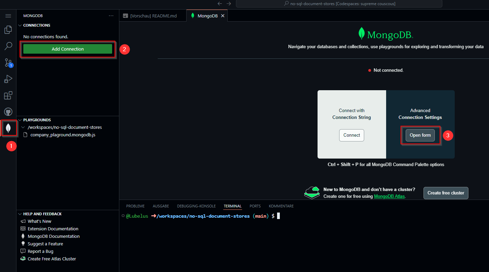

# Codespace für Document Stores (MongoDB & NodeJS)

Das Repository kann als **Github Codespace** geöffnet werden. Dadurch startet eine eine Instanz von Visual Studio Code im Browser. Es funktioniert aber genauso, wenn das Repository lokal gecloned wird. Voraussetzung dafür ist nur die Installation von **Node.js**.

## Initialisieren des Codespaces

Zu Beginn sollte der folgende Befehl ausgeführt werden:

```Shell
npm install
```

## Verbindung zur lokalen Datenbank herstellen

1. MongoDB Erweiterung öffnen
2. "Add Connection" klicken
3. "Open form" unter "Advanced Connection Settings" klicken
4. Mit der Default-URI `mongodb://localhost:27017/` auf "Save & Connect" klicken
5. Verbindung ansehen




# Playgrounds starten

Über die MongoDB Erweiterung können sogenannte **Playgrounds** genutzt werden. Dabei handelt es sich um interaktive Umgebungen, in denen MongoDB-Befehle und -Abfragen ausgeführt werden können. Die Ergebnisse werden in Echtzeit angezeigt.

## Company Example (Grundlegende CRUD Operationen)
In der Datei [company_playground.mongodb.js](playgrounds/company_playground.mongodb.js) befindet sich


## Shipwreck Example (Shipwrecks Collection inkl. Geo-Daten)
